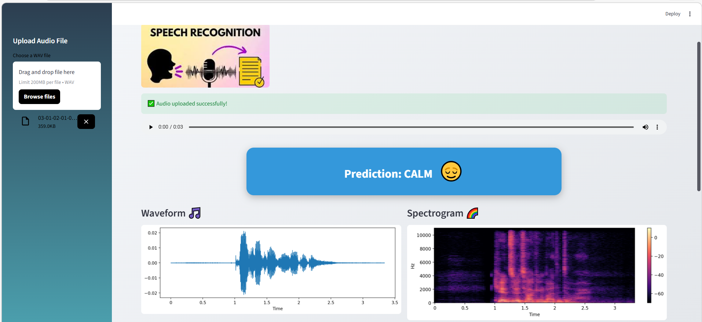

🎙️ Emotion Recognition from Speech using Deep Learning

## Streamlit App Preview

An end-to-end Speech Emotion Recognition (SER) system built using the RAVDESS dataset and Deep Neural Networks.

This project extracts MFCC features from speech audio and classifies emotions with high accuracy using a structured ML pipeline.

🚀 Project Highlights

🎧 Audio signal processing using Librosa

📊 Advanced visualizations (waveform, spectrogram, MFCC, confusion matrix)

🧠 Deep Neural Network model (93% accuracy)

🏗️ Modular and production-ready project structure

🌐 Streamlit web app for real-time emotion prediction

🎯 Business Applications

Speech Emotion Recognition can be applied in:

Customer sentiment analysis

Call center monitoring

Mental health tracking

AI voice assistants

Emotion-aware chatbots

📂 Dataset

This project uses the RAVDESS (Ryerson Audio-Visual Database of Emotional Speech and Song) dataset.

📥 Official Download Link:
https://zenodo.org/record/1188976/files/Audio_Speech_Actors_01-24.zip

⚠️ The dataset is not included in this repository due to size limitations.

📥 How to Use the Dataset

Download the dataset from the link above.

Extract the ZIP file.

Place it inside the following directory:

data/raw/

Your structure should look like:

data/
├── raw/
│   └── RAVDESS/
│        ├── Actor_01/
│        ├── Actor_02/
│        └── Actor_24/
📊 Dataset Information

24 professional actors

8 emotion classes:

Neutral

Calm

Happy

Sad

Angry

Fearful

Disgust

Surprised

1440 total speech audio files (.wav)

🏗️ Project Structure
emotion-recognition-speech/
│
├── data/
│   ├── raw/
│   └── processed/
│
├── notebooks/
│   ├── 01_EDA_&_Data_Loading.ipynb
│   ├── 02_Feature_Engineering.ipynb
│   ├── 03_Model_Training.ipynb
│   ├── 04_Model_Evaluation.ipynb
│   └── 05_Prediction_demo.ipynb
│
├── src/
│   ├── config.py
│   ├── data_loader.py
│   ├── feature_extraction.py
│   ├── model.py
│   ├── train.py
│   ├── evaluate.py
│   └── predict.py
│
├── models/
│   ├── emotion_model.h5
│   ├── scaler.pkl
│   └── label_encoder.pkl
│
├── app.py
├── requirements.txt
└── README.md
⚙️ Feature Engineering

Extracted features:

MFCC (Mel Frequency Cepstral Coefficients)

Feature scaling using StandardScaler

Label encoding

🧠 Model Architecture

Deep Neural Network (DNN):

Dense (256) + Batch Normalization + Dropout

Dense (128) + Batch Normalization + Dropout

Dense (64)

Output layer (Softmax)

Loss Function: Sparse Categorical Crossentropy
Optimizer: Adam

📈 Model Performance

✅ Accuracy: 93%

✅ Balanced class predictions

✅ Confusion matrix visualization

🚀 How to Run the Project
1️⃣ Install Dependencies
pip install -r requirements.txt
2️⃣ Run Notebooks (in order)

01_EDA_&_Data_Loading.ipynb

02_Feature_Engineering.ipynb

03_Model_Training.ipynb

04_Model_Evaluation.ipynb

05_Prediction_demo.ipynb

🌐 Run the Streamlit App
streamlit run app.py

Upload a .wav file and the model will predict the emotion.

📚 Key Learning Outcomes

Audio signal processing

Deep learning classification

Model evaluation techniques

Modular ML project structure

Model deployment using Streamlit